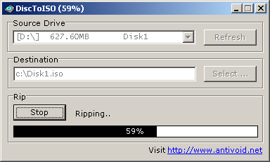

# DiscToISO

### About:
Creates .iso file copies of CDs

### Instructions:
Run "DiscToISO.exe" with a CD in your CD Drive (or click the "Refresh" button after inserting one), select an output file location and click "Start".

### Screenshot:

### Info:
**Created:** 2006

**Operating System:** Windows 2000 or newer

**Compile with:** Borland C++ Builder 6
